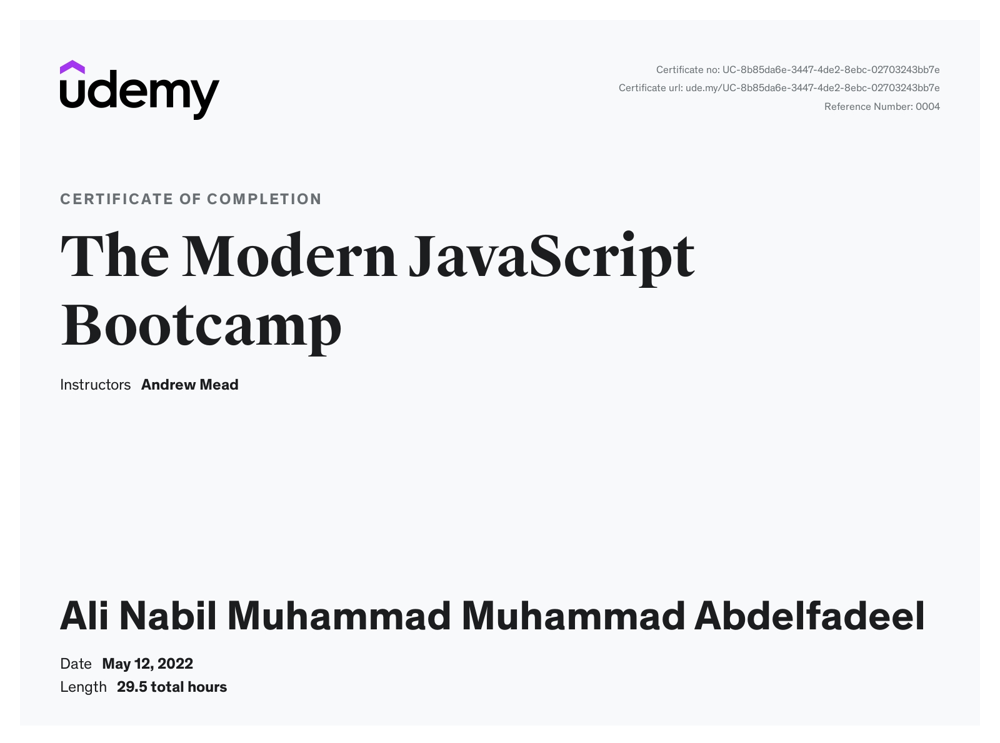

# The Modern JavaScript Bootcamp

## Projects

### Todo app

- [Project-code](./Projects/Todo-app)
- [Live Demo](https://todo-app-alinabil.surge.sh/)

### Notes app

- [Project-code](./Projects/Notes-app)
- [Live Demo](https://notes-app-alinabil.netlify.app/)

### Hangman-Game

- [Project-code](./Projects/Hangman-Game)
- [Live Demo](https://hangman-alinabil.netlify.app/)

---

## Code

[Code](Code)

---

[Course-Link](https://www.udemy.com/course/modern-javascript/) 

[Certificate](https://www.udemy.com/certificate/UC-8b85da6e-3447-4de2-8ebc-02703243bb7e/)

